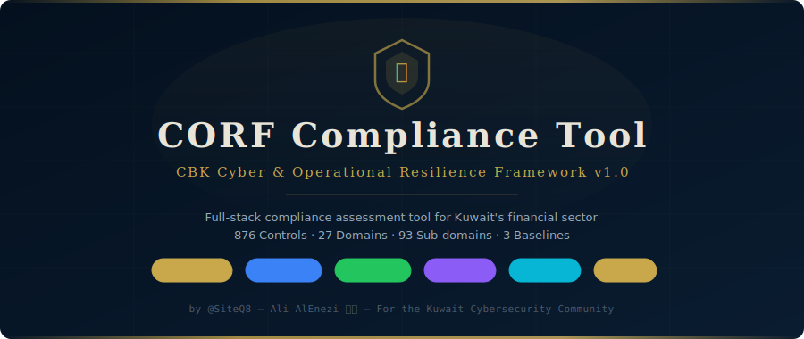
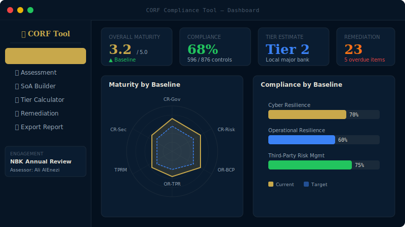
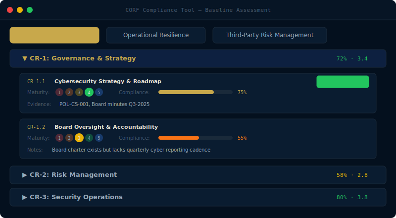
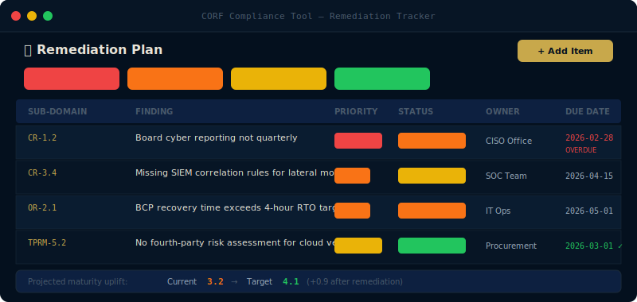

<p align="center">
  
</p>

<p align="center">
  <a href="#-quick-start"></a>
  <a href="LICENSE"></a>
  <a href="#"></a>
  <a href="#"></a>
  <a href="https://github.com/SiteQ8/corf-compliance-tool/stargazers"></a>
  <a href="https://github.com/SiteQ8/corf-compliance-tool/issues"></a>
  <a href="#"></a>
  <a href="#"></a>
</p>

<p align="center">
  <a href="#-features">Features</a> •
  <a href="#-screenshots">Screenshots</a> •
  <a href="#-quick-start">Quick Start</a> •
  <a href="#-api-reference">API</a> •
  <a href="#-contributing">Contributing</a>
</p>

---

## 📋 About

The **CORF Compliance Tool** is an open-source, full-stack web application that helps security consultants, assessors, and compliance officers conduct structured assessments against the Central Bank of Kuwait's **Cyber and Operational Resilience Framework (CORF)**, issued December 2025.

It replaces manual spreadsheets with a structured, database-backed tool featuring automated scoring, interactive dashboards, PDF/Excel reporting, and a full remediation tracker.

> Built for the **Kuwait Cybersecurity Community** — by security consultants, for security consultants.

### Framework Coverage

| Baseline | Domains | Sub-domains | Controls |
|---|---|---|---|
| Cyber Resilience (CR) | 6 | 33 | 519 |
| Operational Resilience (OR) | 8 | 17 | 146 |
| Third-Party Risk Management (TPRM) | 13 | 43 | 211 |
| **Total** | **27** | **93** | **876** |

---

## 📸 Screenshots

### Dashboard
Real-time maturity and compliance metrics with radar charts and bar visualizations.

<p align="center">
  
</p>

### Baseline Assessment
Domain/sub-domain accordion with maturity scoring, compliance sliders, evidence tracking, and auto-save.

<p align="center">
  
</p>

### Remediation Tracker
Track findings with priority, status, ownership, due dates, overdue detection, and maturity uplift projections.

<p align="center">
  
</p>

---

## ✨ Features

### 📊 Dashboard
- Real-time maturity and compliance metrics across all 3 baselines
- Recharts radar + bar charts per baseline
- Overall CORF posture summary with tier estimate
- Remediation status overview with overdue alerts

### ✅ Baseline Assessment
- Full domain/sub-domain accordion UI for all 3 baselines (876 controls)
- **Maturity scoring**: 1-Initial → 2-Ad-hoc → 3-Baseline → 4-Advanced → 5-Innovative
- **Compliance %** slider per sub-domain
- Mark sub-domains as **Not Applicable (N/A)**
- Evidence reference + assessor notes per sub-domain
- **Auto-save** with debounce

### 📋 Statement of Applicability (SoA)
- Complete SoA builder covering all 93 sub-domains
- Toggle applicable / not applicable per domain and sub-domain
- Justification fields for N/A exclusions (CBK requirement)
- Bulk save to database

### 🏷️ Inherent Risk Profiling & Tier Calculator
- 11 CBK tiering dimensions fully implemented
- Real-time tier estimate (Tier 1 / 2 / 3)
- Scoring model based on CORF Framework Section 10
- Save profile to database for reporting

### 🔧 Remediation Tracker
- Add, edit, and track remediation items per sub-domain
- Priority levels: Critical / High / Medium / Low
- Status: Open / In Progress / Completed / Accepted Risk
- Owner assignment + target date with overdue detection
- Maturity uplift tracking (current → target)
- Inline status updates

### 📄 Export & Reporting
- **PDF Report**: Cover page, executive summary, domain table, remediation plan
- **Excel Report**: 5 worksheets — Dashboard, Assessment Results, SoA, Remediation Plan, Risk Profile
- Color-coded, CBK-ready format

---

## 🚀 Quick Start

### Prerequisites
- Node.js 18+
- npm or yarn

### Local Development

```bash
# Clone the repo
git clone https://github.com/SiteQ8/corf-compliance-tool.git
cd corf-compliance-tool

# Backend
cd backend
npm install
npm run dev        # Runs on http://localhost:3001

# Frontend (new terminal)
cd frontend
npm install
npm run dev        # Runs on http://localhost:5173
```

Open [http://localhost:5173](http://localhost:5173)

### Docker (Recommended)

```bash
docker-compose up --build
```

Opens on [http://localhost:80](http://localhost:80)

---

## 🏗️ Architecture

```
corf-compliance-tool/
├── backend/
│   ├── server.js              # Express entry point
│   ├── db/database.js         # SQLite schema & initialization
│   ├── routes/
│   │   ├── engagements.js     # Engagements + assessments CRUD
│   │   ├── data.js            # SoA, risk profile, remediation
│   │   └── reports.js         # PDF + Excel generation
│   └── data/corf-domains.js   # Full CORF domain structure (876 controls)
│
├── frontend/
│   ├── src/
│   │   ├── App.jsx             # Shell, routing, engagement management
│   │   ├── api/client.js       # Axios API client
│   │   ├── styles/global.css   # Dark navy/gold theme
│   │   └── components/
│   │       ├── Dashboard.jsx
│   │       ├── Assessment.jsx
│   │       ├── SoABuilder.jsx
│   │       ├── TierCalculator.jsx
│   │       └── RemediationTracker.jsx
│   └── vite.config.js
│
├── docker-compose.yml
├── docs/screenshots/           # Documentation screenshots
├── SECURITY.md                 # Security policy
├── CONTRIBUTING.md             # Contribution guidelines
├── CODE_OF_CONDUCT.md          # Code of conduct
├── CHANGELOG.md                # Version history
└── LICENSE                     # MIT License
```

### Tech Stack

| Layer | Technology |
|---|---|
| Frontend | React 18 + Vite |
| Charts | Recharts |
| Backend | Node.js + Express |
| Database | SQLite (better-sqlite3) |
| PDF Export | PDFKit |
| Excel Export | ExcelJS |
| Security | Helmet + CORS |
| Container | Docker + Nginx |

---

## 📡 API Reference

| Method | Endpoint | Description |
|--------|----------|-------------|
| `GET` | `/api/health` | Health check |
| `GET` | `/api/corf-data` | Full domain structure (876 controls) |
| `GET` | `/api/engagements` | List all engagements |
| `POST` | `/api/engagements` | Create engagement |
| `GET` | `/api/engagements/:id` | Get engagement details |
| `PATCH` | `/api/engagements/:id` | Update engagement |
| `DELETE` | `/api/engagements/:id` | Delete engagement |
| `GET` | `/api/engagements/:id/summary` | Dashboard summary |
| `GET` | `/api/engagements/:id/assessments` | Get all assessments |
| `PUT` | `/api/engagements/:id/assessments/:subId` | Upsert assessment |
| `POST` | `/api/engagements/:id/assessments/bulk` | Bulk save assessments |
| `GET` | `/api/engagements/:id/soa` | Get SoA data |
| `PUT` | `/api/engagements/:id/soa/:refId` | Update SoA entry |
| `POST` | `/api/engagements/:id/soa/bulk` | Bulk save SoA |
| `GET` | `/api/engagements/:id/risk-profile` | Get risk profile |
| `PUT` | `/api/engagements/:id/risk-profile` | Update risk profile |
| `GET` | `/api/engagements/:id/remediation` | List remediation items |
| `POST` | `/api/engagements/:id/remediation` | Add remediation item |
| `PATCH` | `/api/engagements/:id/remediation/:remId` | Update remediation |
| `DELETE` | `/api/engagements/:id/remediation/:remId` | Delete remediation |
| `GET` | `/api/engagements/:id/reports/pdf` | Generate PDF report |
| `GET` | `/api/engagements/:id/reports/excel` | Generate Excel report |

---

## 🗺️ Roadmap

- [ ] Full 876 individual control entries with descriptions
- [ ] Evidence file attachment support (PDF, images)
- [ ] Multi-user / role-based access (assessor vs reviewer vs approver)
- [ ] Gap auto-detection from low-scoring sub-domains
- [ ] CORWG report templates (official CBK format)
- [ ] Comparison view between assessment periods
- [ ] Sector-level benchmarking (anonymized)
- [ ] Arabic language (RTL) support
- [ ] SSO / LDAP authentication
- [ ] Audit trail logging

---

## 🤝 Contributing

Contributions from the Kuwait Cybersecurity Community are welcome! Whether it's new features, bug fixes, CORF domain data improvements, or documentation.

See [CONTRIBUTING.md](CONTRIBUTING.md) for guidelines.

### Areas for Contribution

- 📝 **Control Descriptions** — Add full descriptions for all 876 controls
- 🌐 **Arabic Support** — RTL layout and Arabic translations
- 📎 **Evidence Uploads** — File attachment support per sub-domain
- 👥 **Multi-User** — Role-based access control
- 📊 **Additional Charts** — Trend lines, gap analysis, heatmaps
- 🧪 **Testing** — Unit tests, integration tests, E2E tests
- 📖 **Documentation** — Tutorials, video walkthroughs

---

## 🔒 Security

Found a vulnerability? Please report it responsibly.

See [SECURITY.md](SECURITY.md) for our security policy and disclosure process. **Do NOT open public issues for security vulnerabilities.**

---

## ⚠️ Disclaimer

This is a **community tool** intended to support CORF preparation and self-assessment. It does not replace:
- Official CBK CORF assessments
- Independent third-party assessments (required annually per CORF Toolkit)
- CBK supervisory review and formal tier classification

Always refer to the official [CBK CORF documentation](https://www.cbk.gov.kw) for authoritative requirements.

**Framework Reference:** Cyber and Operational Resilience Framework for All Local Banks and Financial Institutions, Version 1.0, Central Bank of Kuwait, December 2025.

---

## 📬 Contact

- CBK CORWG: [CORWG@cbk.gov.kw](mailto:CORWG@cbk.gov.kw)
- Community: [GitHub Issues](https://github.com/SiteQ8/corf-compliance-tool/issues) · [Discussions](https://github.com/SiteQ8/corf-compliance-tool/discussions)

---

## 📄 License

MIT License — see [LICENSE](LICENSE) for details.

---

<p align="center">
  <sub>Built with ❤️ for the Kuwait Cybersecurity Community by <a href="https://github.com/SiteQ8">@SiteQ8</a> — Ali AlEnezi 🇰🇼</sub>
</p>
